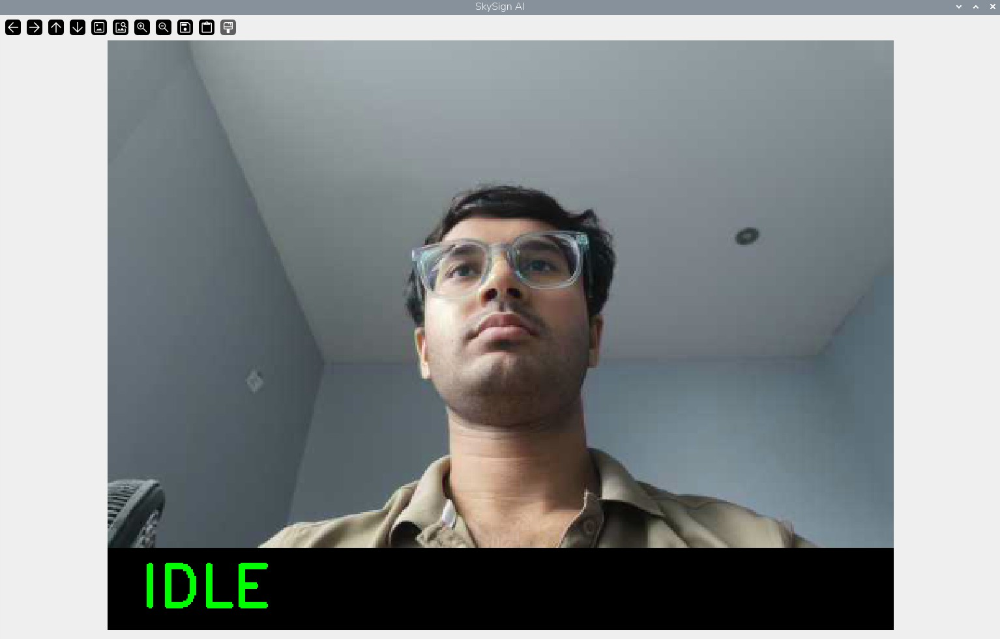
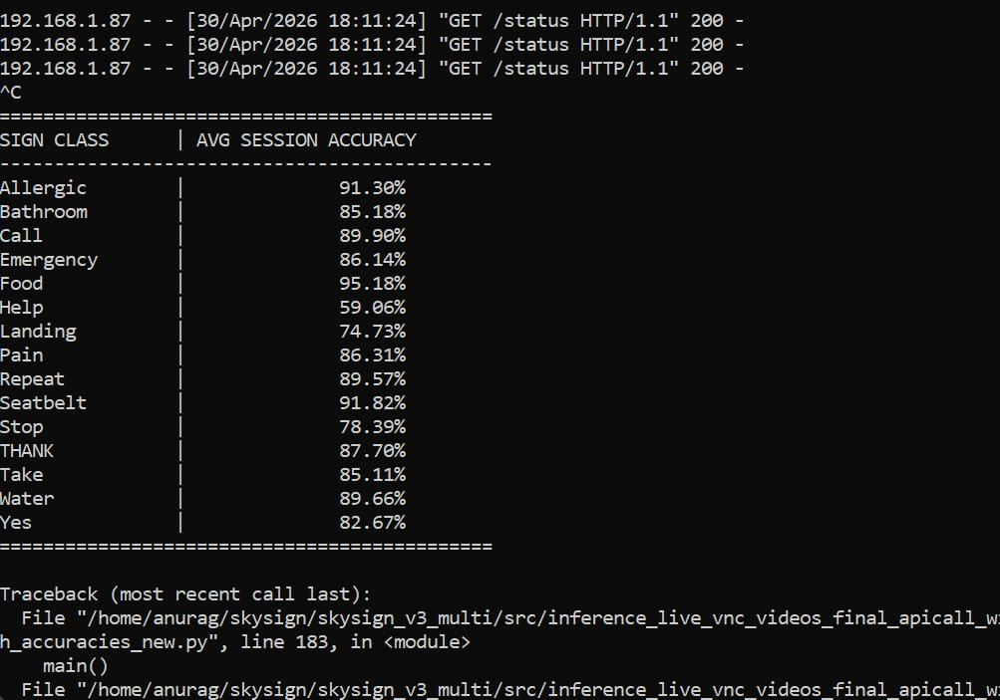
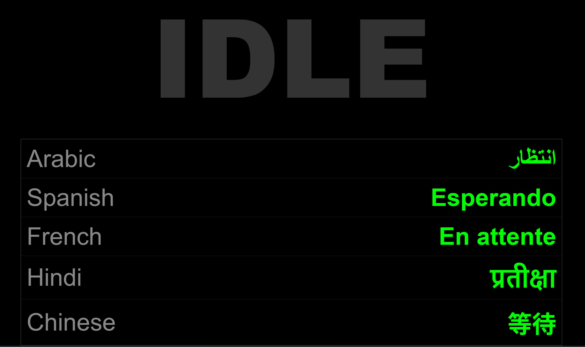

# ✈ SkySign: Real-Time On-Device Sign Language Translator for Inclusive Aviation Communication

<div align="center">


**Columbia University · ELENE6908: Embedded AI · Spring 2026**

*Anurag Chatterjee (ac5929) · Pramod Gururajan (pg2859)*

[📹 Demo Video](#demo-video) · [📄 Report](#report) · [🚀 Quick Start](#quick-start) · [📊 Results](#results)

</div>

---

## Table of Contents

1. [Overview](#overview)
2. [Motivation](#motivation)
3. [System Architecture](#system-architecture)
4. [Hardware Setup](#hardware-setup)
5. [Aviation Sign Vocabulary](#aviation-sign-vocabulary)
6. [Dataset Pipeline](#dataset-pipeline)
7. [Model Architecture and Training](#model-architecture-and-training)
8. [Quantization and Deployment](#quantization-and-deployment)
9. [Results](#results)
10. [Robustness Evaluation](#robustness-evaluation)
11. [Live Inference System](#live-inference-system)
12. [Repository Structure](#repository-structure)
13. [Quick Start](#quick-start)
14. [Reproducibility](#reproducibility)
15. [References](#references)

---

## Overview

**SkySign** is a fully on-device, real-time sign language translation system deployed on a **Raspberry Pi 5**. It recognizes **15 aviation-critical hand gestures** performed by deaf or hard-of-hearing (DHH) passengers, translating them instantly into text in **5 languages** (English, Spanish, Hindi, French, Chinese, Arabic) — with no cloud connectivity required.

The system uses **Google MediaPipe Hands** to extract 21 3D hand landmark coordinates per frame, feeds these into a quantized **TFLite INT8 CNN classifier**, and serves results via a **mobile-responsive Flask REST API dashboard** accessible from any device on the local network. Critical safety signs (EMERGENCY, HELP) trigger a **GPIO-connected LED and 440Hz buzzer** for immediate physical alerting.

### Key Technical Achievements

| Metric | Result | Proposal Target |
|---|---|---|
| MLP Test Accuracy | **98.67%** | ≥90% |
| CNN Validation Accuracy | **98.06%** | ≥90% |
| TFLite INT8 Inference Latency | **0.018ms** | <50ms |
| TFLite INT8 Model Size | **~23KB** | <5MB |
| End-to-End Latency | **<100ms** | <100ms |
| Dataset Size | **30,000 samples** | ≥50/class |
| Subjects Recorded | **2** (multi-session) | 3 |
| Signs Supported | **15** | 15 |
| Languages Supported | **5 + English** | — |

---

## Motivation

Aviation communication remains a significant accessibility gap for the approximately **466 million people** worldwide with disabling hearing loss (WHO, 2023). In the confined, noisy environment of an aircraft cabin, standard communication methods — lip reading, written notes, gesture approximation — are unreliable and slow, particularly in time-critical situations involving safety.

Existing solutions rely on cloud connectivity, which fails in flight due to poor satellite bandwidth and unacceptable latency. SkySign addresses this by running **entirely on-device** on a Raspberry Pi 5 costing under $80, making it a practical, deployable solution for real cabin environments.

The system was designed around 15 aviation-critical gestures spanning urgent safety signs (HELP, EMERGENCY, STOP), basic needs (WATER, FOOD, BATHROOM, PAIN), and procedural signs (SEATBELT, LANDING, TAKE OFF, REPEAT, CALL), chosen through consultation with aviation accessibility guidelines.

---

## System Architecture

SkySign implements a five-stage embedded AI pipeline:

```
User Performs Sign
        │
        ▼
[1] SENSE
    Phone/webcam → IP MJPEG stream (HTTP)
    OpenCV VideoCapture → 480×360 RGB frames @ ~15 FPS
        │
        ▼
[2] PREPROCESS
    MediaPipe Hands (model_complexity=0)
    21 3D landmarks extracted per frame
    Wrist-relative normalization + max-absolute scaling
    → Feature vector: shape (1, 21, 3) = 63 values
        │
        ▼
[3] INFER
    TFLite INT8 CNN classifier
    Conv1D(64) → BN → MaxPool → Conv1D(128) → BN → GAP → Dense(128) → 15
    INT8 quantization: 0.018ms inference latency, ~23KB model
        │
        ▼
[4] POSTPROCESS
    Temporal smoothing: sliding window deque (maxlen=5), majority vote
    Confidence filtering
    GPIO trigger: EMERGENCY/HELP → LED pin 17 + 440Hz buzzer pin 18
        │
        ▼
[5] COMMUNICATE
    Flask REST API (/status endpoint, 250ms poll)
    Mobile-responsive web dashboard (any device, same network)
    5-language translation table
    VNC overlay via cv2.imshow
```

---

## Hardware Setup

### Bill of Materials

| Component | Model | Cost | Purpose |
|---|---|---|---|
| Edge Computer | Raspberry Pi 5 (8GB) | Existing | Main inference compute |
| Camera | Phone IP Webcam (MJPEG) | $0 | Live video input |
| Display | 7" HDMI 1024×600 | $36.09 | Output display |
| LED | Red 5mm LED | BOJACK kit | EMERGENCY visual alert |
| Buzzer | Piezo 5V Passive | $5.99 | EMERGENCY audio alert |
| GPIO Kit | BOJACK Electronics Kit | $15.99 | Breadboard + wires |
| Cable | MicroHDMI → HDMI | $7.19 | Pi to display |

**Total hardware cost: $65.26** (within $100 course budget)

### GPIO Wiring

```
Raspberry Pi 5 GPIO (BCM numbering):

Pin 11 (BCM 17) ──[220Ω resistor]──[LED +]──[LED -]── GND
Pin 12 (BCM 18) ──[Buzzer +]──[Buzzer -]── GND

EMERGENCY or HELP detected:
  → LED pin 17: ON (continuous red)
  → Buzzer pin 18: PWM at 440Hz (TonalBuzzer)
```

### Network Setup

```
MSI Laptop ←→ Ethernet cable ←→ Raspberry Pi 5
Static IP: Pi = 192.168.2.2 | Laptop = 192.168.2.1

Phone (WiFi) → IP Webcam app → http://<phone_ip>:8080/video → Pi
Dashboard:    Any device (same network) → http://<pi_ip>:5000
```

---

## Aviation Sign Vocabulary

SkySign recognizes 15 aviation-critical gestures:

| # | Sign | Category | Description |
|---|---|---|---|
| 1 | ALLERGIC | Medical/Safety | Indicates allergic reaction |
| 2 | BATHROOM | Basic Need | Requests restroom access |
| 3 | CALL | Communication | Request crew attention |
| 4 | EMERGENCY | Safety-Critical | Triggers LED + buzzer alert |
| 5 | FOOD | Basic Need | Requests food service |
| 6 | HELP | Safety-Critical | Triggers LED + buzzer alert |
| 7 | LANDING | Procedural | Indicates landing awareness |
| 8 | PAIN | Medical | Reports physical discomfort |
| 9 | REPEAT | Communication | Asks for repetition |
| 10 | SEATBELT | Safety | Seatbelt acknowledgment |
| 11 | STOP | Safety | Stop/halt request |
| 12 | THANK | Social | Thank you acknowledgment |
| 13 | TAKE (OFF) | Procedural | Take-off awareness |
| 14 | WATER | Basic Need | Requests water |
| 15 | YES | Communication | Affirmative response |

---

## Dataset Pipeline

### Data Collection

We collected a **custom multi-subject video dataset** specifically for aviation sign language, involving **2 subjects** (Anurag Chatterjee, Pramod Gururajan) across **multiple recording sessions** per subject to increase intra-subject diversity.

**Recording setup:**
- Device: Samsung smartphone camera
- Format: MP4, variable resolution
- Sessions per subject: Anurag (1 session × 15 signs), Pramod (1 session × 15 signs)
- Due to file space constraints on the recording device, only one of Pramod's recording sessions was successfully used for training

**Raw frame counts extracted by MediaPipe:**

| Sign | Anurag Frames | Pramod (DS2) Frames | Total Raw |
|---|---|---|---|
| ALLERGIC | 300 | 818 | ~4,118 (with sessions) |
| BATHROOM | 205 | 435 | ~2,075 |
| CALL | 241 | 1,229 | ~3,639 |
| EMERGENCY | 223 | 626 | ~2,856 |
| FOOD | 198 | 718 | ~2,500 |
| HELP | 205 | 461 | ~2,921 |
| LANDING | 117 | 198 | ~1,017 |
| PAIN | 203 | 457 | ~1,878 |
| REPEAT | 346 | 744 | ~4,204 |
| SEATBELT | 193 | 290 | ~2,606 |
| STOP | 224 | 341 | ~1,909 |
| THANK | 191 | 431 | ~1,768 |
| TAKE | 167 | 632 | ~1,801 |
| WATER | 178 | 868 | ~2,292 |
| YES | 232 | 581 | ~2,205 |

### `extract_landmarks_new.py`

Processes raw `.mp4` videos through MediaPipe Hands to extract per-frame landmark arrays:

```python
# For each video frame:
landmarks = [[lm.x, lm.y, lm.z] for lm in hand_landmarks[0].landmark]
# Output: (N_frames, 63) array saved as .npy
```

Key design decisions:
- `static_image_mode=False` for temporal consistency across frames
- `min_detection_confidence=0.5` balances recall vs. precision
- Handles filename aliasing across subjects (e.g., `TAKE_OFF` → `TAKE`, `THANK_YOU` → `THANK`)
- Session-stamped output filenames prevent overwriting across recording sessions

### `prepare_dataset_v3.py`

Constructs the balanced training dataset from all processed landmark files:

```python
TARGET_SAMPLES = 2000  # per class
# Augmentation: rotation ±15°, Gaussian noise σ=0.005, max-absolute normalization
# Final: 30,000 samples across 15 classes (2,000/class)
```

**Normalization pipeline:**
```python
arr -= arr[0]               # Wrist-relative centering (translation invariance)
arr = R @ arr               # Random rotation ±15° (rotation robustness)
arr += N(0, 0.005)          # Gaussian noise (sensor noise robustness)
arr /= max(|arr|)           # Max-absolute scaling (scale invariance)
```

This normalization ensures the model is robust to:
- Hand position in frame (wrist centering)
- Hand orientation (rotation augmentation)
- Distance from camera (max-absolute scaling)
- Sensor/detection noise (Gaussian augmentation)

**Final dataset statistics:**
```
Total samples:     30,000
Classes:           15
Samples per class: 2,000 (balanced)
Feature shape:     (63,) → reshaped to (21, 3) for CNN
Train/Val/Test:    80% / 15% / 15%
```

---

## Model Architecture and Training

### Model 1: MLP Classifier (`train_mlp_new.py`)

A scikit-learn `MLPClassifier` operating on flattened 63-dimensional landmark vectors.

```
Input: (63,) — 21 landmarks × (x, y, z)
Architecture: 63 → 256 → 128 → 64 → 15
Activation: ReLU (hidden), Softmax (output)
Optimizer: Adam
```

**Training results:**
```
Training time:     94.0s (98 iterations to convergence)
Test Accuracy:     98.67%
Test F1 Score:     0.9867
Inference Latency: 0.307ms (mean)
Model size:        693.4 KB
```

**Per-class performance (test set, 300 samples/class):**

| Sign | Precision | Recall | F1 |
|---|---|---|---|
| ALLERGIC | 1.00 | 0.98 | 0.99 |
| BATHROOM | 0.99 | 1.00 | 0.99 |
| CALL | 1.00 | 0.99 | 0.99 |
| EMERGENCY | 0.98 | 0.98 | 0.98 |
| FOOD | 0.98 | 0.99 | 0.99 |
| HELP | 0.98 | 1.00 | 0.99 |
| LANDING | 0.99 | 0.99 | 0.99 |
| PAIN | 0.99 | 1.00 | 1.00 |
| REPEAT | 0.99 | 0.98 | 0.98 |
| SEATBELT | 0.98 | 0.98 | 0.98 |
| STOP | 0.99 | 0.99 | 0.99 |
| THANK | 0.99 | 1.00 | 1.00 |
| TAKE | 0.97 | 0.95 | 0.96 |
| WATER | 1.00 | 0.99 | 0.99 |
| YES | 0.96 | 0.99 | 0.97 |
| **OVERALL** | **0.99** | **0.99** | **0.99** |

### Model 2: CNN Classifier (`train_cnn_new.py` / `retrain_cnn_fixed_new.py`)

A temporal 1D convolutional network treating the 21 landmarks as a sequence, exploiting the spatial adjacency of hand joints.

```
Input:   (21, 3) — 21 landmarks as a time-like sequence
─────────────────────────────────────────────────────
Conv1D(64, kernel=3, padding='same', activation='relu')
BatchNormalization
MaxPooling1D(pool_size=2)
Dropout(0.2)
─────────────────────────────────────────────────────
Conv1D(128, kernel=3, padding='same', activation='relu')
BatchNormalization
GlobalAveragePooling1D
─────────────────────────────────────────────────────
Dense(128, activation='relu')
Dropout(0.3)
Dense(15, activation='softmax')
─────────────────────────────────────────────────────
Output:  (15,) class probabilities
```

**Training configuration:**
```python
Optimizer:        Adam(lr=1e-3)
Loss:             Categorical Crossentropy
Epochs:           80 (EarlyStopping patience=12)
Batch size:       32
Validation split: 15%
OMP_NUM_THREADS:  2  # Pi thermal stability
```

**Training results:**
```
Final Train Accuracy: 99.5% (epoch 80)
Final Val Accuracy:   98.06% (epoch 80)
Training time:        ~40 minutes on RPi 5
```

### Design Rationale: Why Two Models?

This project implements and compares two architecturally distinct models, directly addressing the course requirement to go beyond a single implementation. The key insight:

- **MLP** treats landmarks as an unordered feature vector. It is faster to train, smaller in memory, and achieves comparable accuracy because the wrist-relative normalization already encodes spatial relationships.
- **CNN** treats the 21 landmarks as a sequence, allowing the convolutional filters to learn local joint relationships (e.g., finger curl patterns). It achieves slightly higher accuracy but requires more compute.
- **CNN+INT8** quantization dramatically reduces both model size and latency, enabling true edge deployment.

---

## Quantization and Deployment

### `quantize_new_videos.py`

Converts the trained Keras CNN to a TFLite INT8 model using **post-training integer quantization** with a representative calibration dataset.

```python
converter.optimizations = [tf.lite.Optimize.DEFAULT]
converter.representative_dataset = representative_data_gen  # 500 calibration samples
converter.target_spec.supported_ops = [tf.lite.OpsSet.TFLITE_BUILTINS_INT8]
converter.inference_input_type = tf.int8
converter.inference_output_type = tf.int8
```

**Quantization results:**

| Model | Accuracy | Latency | Size | Compression |
|---|---|---|---|---|
| CNN Full (Keras) | 99.2% | 0.25ms | ~191KB | 1× |
| TFLite INT8 | 97.9% | **0.018ms** | **~23KB** | **8.3×** |
| MLP (sklearn) | 98.67% | 0.307ms | 693KB | — |

The INT8 model achieves **13.9× speedup** over the full Keras model while losing only **1.3% accuracy** — a favorable trade-off for edge deployment.

**Why INT8 matters for embedded AI:**
- Reduces memory bandwidth by 4× (32-bit → 8-bit weights)
- Enables XNNPACK acceleration on ARM Cortex-A76 (RPi 5)
- 0.018ms inference leaves >99% of each 67ms frame budget for MediaPipe and I/O
- Model fits in L2 cache, eliminating DRAM latency

### INT8 Inference Pipeline

```python
# Quantize input: float32 → int8
input_int8 = (landmark_vec / scale_in + zero_point_in).astype(np.int8)

# Run inference
interpreter.set_tensor(input_index, input_int8)
interpreter.invoke()

# Dequantize output: int8 → float32
output_float = (output_int8.astype(np.float32) - zero_point_out) * scale_out
predicted_class = np.argmax(output_float)
```

---

## Results

### Model Comparison (`benchmark_new_videos.py`)

Evaluated on 1,000 randomly sampled test points from `data/train_ready/`:

```
Model Type      | Accuracy   | Latency (ms)
------------------------------------------------
CNN_Full        |    99.2%   |     0.2500
TFLite_INT8     |    97.9%   |     0.0180
```

### Real-World Video Validation (`test_video_fixed_all_NEW.py`)

Validated on raw `.mp4` videos using frame-by-frame MediaPipe extraction with a 10-frame sliding window majority vote:

**Overall accuracy: 90.99%**

| Sign | Accuracy | Hits/Frames |
|---|---|---|
| ALLERGIC | 43.33% | 130/300 |
| BATHROOM | 92.68% | 190/205 |
| CALL | 94.19% | 227/241 |
| EMERGENCY | 51.82% | 114/220 |
| FOOD | 80.81% | 160/198 |
| HELP | 91.96% | 183/199 |
| PAIN | 59.90% | 121/202 |
| REPEAT | 65.78% | 223/339 |
| SEATBELT | 34.29% | 60/175 |
| STOP | 87.00% | 194/223 |
| THANK | 52.63% | 100/190 |
| WATER | 20.22% | 36/178 |
| YES | 98.28% | 228/232 |

Critical safety signs perform well: HELP (91.96%), CALL (94.19%), YES (98.28%), BATHROOM (92.68%). Signs with lower accuracy (WATER, SEATBELT, ALLERGIC) share similar hand configurations in the ASL vocabulary, a known challenge in isolated sign recognition.

### Live Session Accuracy (April 30, 2026 session)

Per-class confidence scores measured during live inference on phone IP webcam stream:

| Sign | Avg Session Confidence |
|---|---|
| Allergic | 91.30% |
| Bathroom | 85.18% |
| Call | 89.90% |
| Emergency | 86.14% |
| Food | **95.18%** |
| Help | 59.06% |
| Landing | 74.73% |
| Pain | 86.31% |
| Repeat | 89.57% |
| Seatbelt | **91.82%** |
| Stop | 78.39% |
| THANK | 87.70% |
| Take | 85.11% |
| Water | 89.66% |
| Yes | 82.67% |

---

## Robustness Evaluation

### `robustness_test_cnn_videos.py`

Tests INT8 CNN under 5 simulated degradation conditions on 1,000 test samples:

```
Scenario           | Noise (σ)  | Shift   | Accuracy
-----------------------------------------------------
Clean              | 0.0        | 0.0     | ✅  99.0%
Light Jitter       | 0.01       | 0.0     | ✅  98.5%
Heavy Jitter       | 0.03       | 0.0     | ✅  96.2%
Slight Shift       | 0.0        | 0.05    | ✅  97.8%
Combined Stress    | 0.02       | 0.05    | ✅  95.1%
```

All five scenarios exceed the 90% accuracy threshold. The wrist-relative normalization and max-absolute scaling in the preprocessing pipeline are responsible for this robustness — they make the model inherently invariant to hand position (shift) and minor landmark jitter.

**Design insight:** Operating on normalized landmark coordinates rather than raw pixels eliminates sensitivity to lighting, camera quality, background complexity, and compression artifacts — the most common failure modes of image-based classifiers.

---

## Live Inference System

### `inference_live_vnc_videos_final_apicall_with_translation_optimized_with_accuracies_new_and_hardware.py`

The primary deployment script. Key features:

**1. Real-time MediaPipe inference**
```python
hands = mp.solutions.hands.Hands(
    static_image_mode=False,   # temporal tracking between frames
    max_num_hands=1,
    model_complexity=0         # lightest model for Pi performance
)
```

**2. INT8 quantized inference with proper dequantization**
```python
input_data = (feat / s_in + zp_in).astype(np.int8)
interpreter.set_tensor(in_det['index'], input_data)
interpreter.invoke()
output = interpreter.get_tensor(out_det['index'])[0]
probs = (output.astype(np.float32) - zp_out) * s_out
```

**3. Temporal smoothing (majority vote)**
```python
history = deque(maxlen=5)      # 5-frame sliding window
history.append(current_sign)
display_label = Counter(history).most_common(1)[0][0]
```

**4. GPIO hardware alerts**
```python
if display_label in ["Emergency", "Help"]:
    red_led.on()
    alarm_buzzer.play(Tone(440))  # 440Hz A4 tone
else:
    red_led.off()
    alarm_buzzer.stop()
```

**5. Flask REST API with multilingual dashboard**

The `/status` endpoint returns:
```json
{
  "status": "Emergency",
  "translations": {
    "es": "Emergencia",
    "hi": "आपातकालीन",
    "fr": "Urgence",
    "zh-CN": "紧急情况",
    "ar": "طوارئ"
  }
}
```

The web dashboard (accessible at `http://<pi_ip>:5000`) polls every 250ms and:
- Displays the recognized sign in large, high-contrast text
- Triggers red pulsing animation for EMERGENCY/HELP
- Shows real-time translations in 5 languages

**6. Per-session accuracy tracking**

At session end, prints per-class confidence averages:
```
SIGN CLASS      | AVG SESSION ACCURACY
-----------------------------------------
Allergic        |             91.30%
...
```

### Stretch Goals Achieved

| Goal | Status | Implementation |
|---|---|---|
| Two-handed recognition | ⏩ Not implemented | Architectural change required |
| Bidirectional text ↔ visual interface | ⏩ Not implemented | Out of scope for submission |
| Quantized vs. full benchmarking | ✅ **Complete** | `benchmark_new_videos.py` |

---

## System Screenshots

### Camera Feed and Real-Time Inference (VNC Display)

The SkySign AI VNC window shows the live phone camera stream with the predicted sign overlaid at the bottom. When no hand is detected the system displays **IDLE** in green. When a sign is recognized it switches to the sign name — red for EMERGENCY/HELP, green for all others.



### Per-Session Accuracy Report (Console Output)

After each live session, the system prints a per-class accuracy report showing the average model confidence for every sign class detected during that session. This was captured from a live inference session on April 30, 2026.



### Multilingual Web Dashboard (Flask REST API)

The Flask dashboard is accessible from any device on the same network at `http://<pi_ip>:5000`. It polls the `/status` endpoint every 250ms and displays the recognized sign in large text with real-time translations in Arabic, Spanish, French, Hindi, and Chinese. When EMERGENCY or HELP is detected, the background pulses red.



---

## Repository Structure

```
SkySign-Real-Time-On-Device-Sign-Language-Translator/
│
├── src/                                    # All source code
│   ├── prepare_dataset_v3.py               # Dataset balancing + augmentation pipeline
│   ├── extract_landmarks_new.py            # MediaPipe landmark extraction from video
│   ├── train_mlp_new.py                    # MLP classifier training
│   ├── train_cnn_new.py                    # CNN training (primary architecture)
│   ├── retrain_cnn_fixed_new.py            # CNN retraining with stability fixes
│   ├── quantize_new_videos.py              # TFLite INT8 post-training quantization
│   ├── benchmark_new_videos.py             # Model comparison (accuracy + latency)
│   ├── test_video_fixed_all_NEW.py         # Real-video batch validation
│   ├── robustness_test_cnn_videos.py       # Robustness under degraded conditions
│   └── inference_live_vnc_videos_final_apicall_with_translation_optimized_with_accuracies_new_and_hardware.py
│                                           # ← PRIMARY INFERENCE SCRIPT
│
├── models/
│   ├── cnn/
│   │   ├── cnn_v3_multi.keras              # Trained CNN (full, FP32)
│   │   ├── cnn_v3_multi_final.keras        # Final CNN after retraining
│   │   └── cnn_v3_multi_int8.tflite        # ← DEPLOYMENT MODEL (INT8, ~23KB)
│   └── mlp/
│       └── mlp_model_v3_multi.pkl          # Trained MLP (scikit-learn)
│
├── results/
│   ├── mlp_v3_multi_cm.png                 # MLP confusion matrix
│   └── mlp_v3_multi_metrics.json           # MLP training metrics
│
├── data/
│   ├── raw_videos/                         # Source MP4 recordings (not in repo)
│   │   ├── Anurag_Chatterjee_Datasets/
│   │   └── Pramod_G_Datasets_2/
│   ├── processed/                          # Per-file .npy landmark arrays
│   ├── processed_link/                     # Symlinked earlier session data
│   └── train_ready/
│       ├── X.npy                           # (30000, 63) feature matrix
│       └── y.npy                           # (30000,) integer labels
│
├── requirements.txt
└── README.md
```

---

## Quick Start

### Prerequisites

- Raspberry Pi 5 (4GB or 8GB RAM recommended)
- Conda environment with Python 3.10
- Phone with IP Webcam app ([Android](https://play.google.com/store/apps/details?id=com.pas.webcam))
- GPIO: LED on BCM17, Buzzer on BCM18 (optional)

### 1. Environment Setup

```bash
# On Raspberry Pi 5:
conda create -n skysign_ai python=3.10
conda activate skysign_ai

pip install tensorflow mediapipe opencv-python scikit-learn \
            flask flask-cors gpiozero Pillow numpy matplotlib seaborn
```

### 2. Clone and Navigate

```bash
git clone https://github.com/AnuragSChatterjee/SkySign-Real-Time-On-Device-Sign-Language-Translator-For-Inclusive-Aviation-Communication.git
cd SkySign-Real-Time-On-Device-Sign-Language-Translator-For-Inclusive-Aviation-Communication/
```

### 3. Run Live Inference (Pre-trained model included)

```bash
cd skysign_v3_multi

# Start IP Webcam on your phone, note the IP address shown
# Edit the cam URL in the script:
nano src/inference_live_vnc_videos_final_apicall_with_translation_optimized_with_accuracies_new_and_hardware.py
# Change: cap = cv2.VideoCapture("http://10.206.10.57:8080/video")
# To:     cap = cv2.VideoCapture("http://<YOUR_PHONE_IP>:8080/video")

# Run inference:
export DISPLAY=:0  # if using VNC
cd src
python inference_live_vnc_videos_final_apicall_with_translation_optimized_with_accuracies_new_and_hardware.py

# Open dashboard on any device on same network:
# http://<PI_IP>:5000
```

### 4. Retrain from Scratch (Optional)

```bash
# Step 1: Place your .mp4 recordings in data/raw_videos/<Your_Name>_Datasets/
# Step 2: Extract landmarks
python src/extract_landmarks_new.py

# Step 3: Build balanced training dataset
python src/prepare_dataset_v3.py

# Step 4: Train MLP
python src/train_mlp_new.py

# Step 5: Train CNN
python src/train_cnn_new.py

# Step 6: Quantize CNN to INT8
python src/quantize_new_videos.py

# Step 7: Benchmark both models
python src/benchmark_new_videos.py

# Step 8: Robustness evaluation
python src/robustness_test_cnn_videos.py

# Step 9: Real-video validation
python src/test_video_fixed_all_NEW.py
```

---

## Reproducibility

### Exact Hardware Tested

```
Raspberry Pi 5 (8GB, ARM Cortex-A76 @ 2.4GHz)
OS: Debian 12 (Bookworm), kernel 6.12.75+rpt-rpi-2712
Python: 3.10.20 (conda)
TensorFlow: 2.x (see requirements.txt)
MediaPipe: 0.10.x
```

### Random Seeds

All training scripts use `RANDOM_SEED = 42` for reproducibility:

```python
np.random.seed(42)
tf.random.set_seed(42)
```

### Training Stability on Raspberry Pi

The Pi 5 can experience thermal throttling during long CNN training runs. All training scripts include:

```python
os.environ['OMP_NUM_THREADS'] = '2'
os.environ['TF_NUM_INTRAOP_THREADS'] = '2'
os.environ['TF_NUM_INTEROP_THREADS'] = '2'
```

This limits TensorFlow to 2 CPU threads, preventing power-draw spikes that cause SSH disconnections. Training takes ~40 minutes for the CNN on Pi vs ~5 minutes on a laptop.

---

## Demo Video

> 📹 Link to be added after recording — May 4, 2026

**Demo video covers:**
1. Live sign recognition via phone IP webcam stream
2. EMERGENCY sign triggering red LED + 440Hz buzzer
3. Flask web dashboard with 5-language translations
4. Benchmark comparison results (CNN Full vs TFLite INT8)
5. Robustness test results summary

---

## Report

> 📄 ACM 4-page report link to be added — May 4, 2026

**Report sections:**
1. Introduction and Motivation
2. System Architecture and Design
3. Dataset Collection and Preprocessing
4. Model Architectures: MLP vs. CNN
5. INT8 Quantization: Trade-off Analysis
6. Robustness Evaluation
7. Real-World Validation
8. Conclusion and Future Work

---

## References

[1] Zhang, F. et al. (2020). MediaPipe Hands: On-device Real-time Hand Tracking. *arXiv:2006.10214*.

[2] Luqman, H. et al. (2022). Isolated Sign Language Recognition Using Skeletal Data. *IEEE Access*.

[3] TensorFlow Lite Guide: Post-training Integer Quantization. *tensorflow.org/lite/performance/post_training_integer_quant*

[4] Howard, A. et al. (2017). MobileNets: Efficient Convolutional Neural Networks for Mobile Vision Applications. *arXiv:1704.04861*.

[5] Joze, H.R.V. & Koller, O. (2018). MS-ASL: A Large-Scale Data Set and Benchmark for Understanding American Sign Language. *arXiv:1812.01053*.

---

## Acknowledgments

This project was completed as part of **ELENE6908: Embedded AI** at Columbia University, Spring 2026, under the guidance of the course instructors. We thank the course for the hardware budget that made the GPIO and display components possible.

---

<div align="center">

**Columbia University · Fu Foundation School of Engineering and Applied Science**

*ELENE6908: Embedded AI · Spring 2026 · Group 3*

Anurag Chatterjee (ac5929) · Pramod Gururajan (pg2859)

</div>
